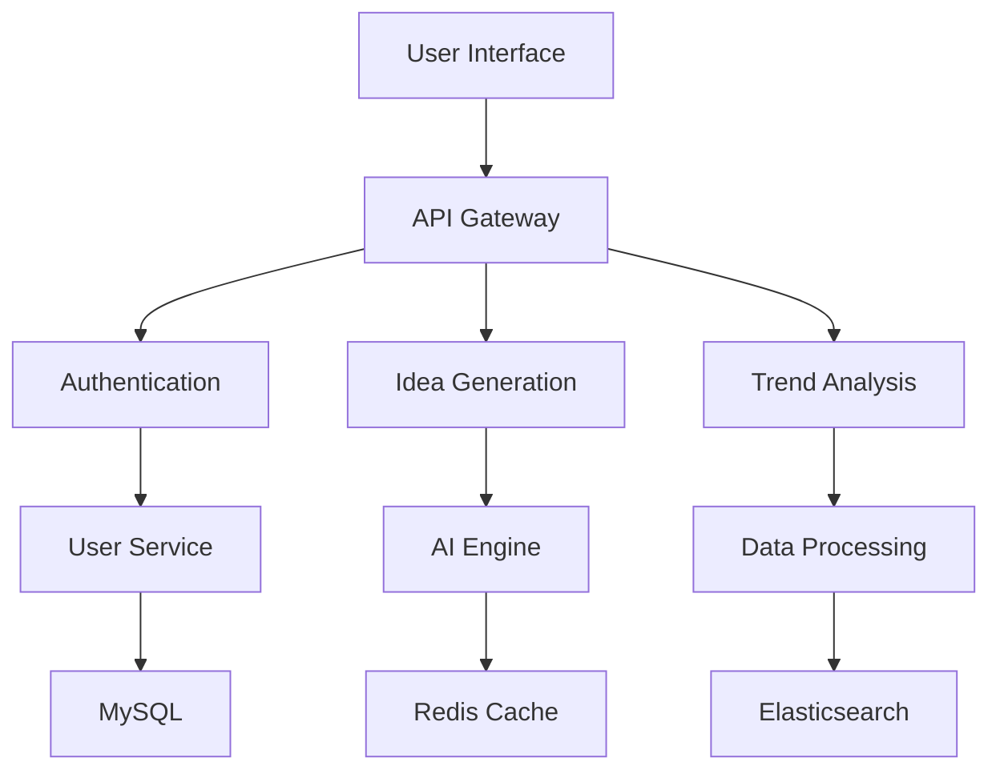

# AppSpark Technical Specification

## 1. System Overview

**Technology Stack:** Modern LAMP + AI
- **Frontend:** React.js + Tailwind CSS
- **Backend:** PHP 8.2 + Laravel
- **Database:** MySQL 8.0 + Redis
- **AI/ML:** Python 3.10 + PyTorch
- **Infrastructure:** Docker + Kubernetes

## 2. Architecture Diagram

## 3. Core Components

### 3.1 Data Collection Layer
- **Reddit API Integration**
  - OAuth2 authentication
  - Rate limiting (60 requests/minute)
  - Caching mechanism
- **Web Scraping**
  - BeautifulSoup for HTML parsing
  - Scrapy for large-scale scraping
  - Proxy rotation system

### 3.2 Data Processing Pipeline
1. **Ingestion**
   - Kafka message queue
   - Data validation
   - Schema enforcement
2. **Transformation**
   - NLP preprocessing
   - Sentiment analysis
   - Entity recognition
3. **Storage**
   - MySQL for structured data
   - Elasticsearch for full-text search
   - S3 for raw data storage

### 3.3 AI Engine
- **Model Architecture**
  - BERT-based text classification
  - GPT-3.5 for idea generation
  - Custom ML models for validation
- **Training Pipeline**
  - Data labeling interface
  - Continuous learning
  - Model versioning

### 3.4 API Layer
- **RESTful API**
  - Versioned endpoints
  - Rate limiting
  - Comprehensive documentation
- **GraphQL**
  - For complex queries
  - Real-time subscriptions
  - Schema stitching

## 4. Infrastructure

### 4.1 Deployment Architecture
- **Containerization**
  - Docker for application packaging
  - Kubernetes for orchestration
  - Helm for deployment management
- **Cloud Infrastructure**
  - AWS/GCP/Azure support
  - Terraform for infrastructure as code
  - CI/CD pipeline integration

### 4.2 Monitoring & Logging
- **Observability**
  - Prometheus for metrics
  - Grafana for visualization
  - ELK stack for logging
- **Alerting**
  - PagerDuty integration
  - Slack notifications
  - Custom thresholds

## 5. Security Architecture

### 5.1 Data Security
- Encryption at rest (AES-256)
- Encryption in transit (TLS 1.3)
- Regular security audits
- Data anonymization

### 5.2 Application Security
- OWASP Top 10 compliance
- Rate limiting
- Input validation
- Security headers

### 5.3 Access Control
- Role-based access control (RBAC)
- Multi-factor authentication
- Audit logging
- Session management

## 6. Development Practices

### 6.1 Code Quality
- Static code analysis
- Unit testing (PHPUnit, Jest)
- Integration testing
- Code reviews

### 6.2 CI/CD Pipeline
1. **Build Stage**
   - Dependency installation
   - Linting
   - Unit tests
2. **Test Stage**
   - Integration tests
   - Security scans
   - Performance tests
3. **Deploy Stage**
   - Canary deployments
   - Blue-green deployment
   - Rollback mechanism

## 7. Performance Optimization

### 7.1 Database Optimization
- Index optimization
- Query caching
- Read replicas
- Connection pooling

### 7.2 Application Optimization
- Opcache for PHP
- React memoization
- Lazy loading
- Code splitting

### 7.3 Caching Strategy
- Redis for session storage
- Memcached for query caching
- CDN for static assets
- Browser caching

## 8. Scalability Plan

### 8.1 Vertical Scaling
- Auto-scaling groups
- Load balancer configuration
- Database sharding

### 8.2 Horizontal Scaling
- Microservices architecture
- Message queue system
- Distributed caching

## 9. Maintenance Strategy

### 9.1 Routine Maintenance
- Security patches
- Dependency updates
- Database optimization
- Log rotation

### 9.2 Monitoring
- Application performance
- Error tracking
- Resource utilization
- Business metrics

## 10. Technology Roadmap

### Phase 1 (0-3 months)
- Core functionality
- Basic AI integration
- MVP release

### Phase 2 (3-6 months)
- Advanced AI features
- Performance optimization
- Scalability improvements

### Phase 3 (6-12 months)
- Mobile app development
- Advanced analytics
- Marketplace integration
