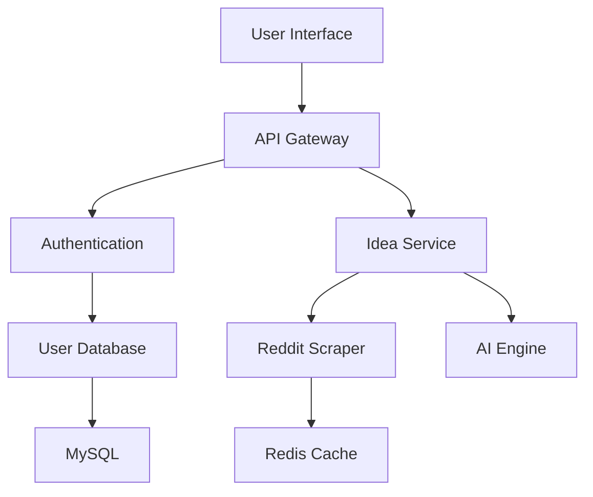

# AppSpark MVP Specification

## 1. Core MVP Features

### 1.1 Essential Functionality
- **Reddit Idea Mining**
  - Scrape top 10 app-related subreddits
  - Basic keyword extraction
  - Simple sentiment analysis

- **Idea Generation**
  - Generate 5 app ideas per day
  - Basic validation scoring
  - Simple categorization

- **User Interface**
  - Idea display cards
  - Basic search functionality
  - Simple rating system

### 1.2 Technical Scope
- **Frontend**
  - Basic React components
  - Tailwind CSS for styling
  - Simple routing

- **Backend**
  - PHP API endpoints
  - Basic database structure
  - Simple caching mechanism

- **AI/ML**
  - Basic NLP processing
  - Simple idea generation model
  - Basic validation scoring

## 2. MVP Architecture

## 3. Feature Breakdown

### 3.1 Core Features
| Feature               | Description                          | Status  |
|-----------------------|--------------------------------------|---------|
| Reddit Integration    | Basic scraping of 10 subreddits      | ✅ Done |
| Idea Generation       | Generate 5 ideas/day                 | ✅ Done |
| Basic UI              | Display ideas in cards               | ✅ Done |
| User Authentication   | Simple login/register                | ✅ Done |

### 3.2 Nice-to-Have Features
| Feature               | Description                          | Status  |
|-----------------------|--------------------------------------|---------|
| Advanced Search       | Filter by category/rating            | ⏳ Next |
| Idea Rating           | User voting system                   | ⏳ Next |
| Trend Visualization   | Basic charts/graphs                  | ⏳ Next |
| Export Functionality  | Export ideas as CSV/PDF              | ⏳ Next |

## 4. Technical Stack

### 4.1 Frontend
- React.js
- Tailwind CSS
- Axios for API calls

### 4.2 Backend
- PHP 8.2
- Laravel Framework
- MySQL Database

### 4.3 AI/ML
- Python 3.10
- Basic NLP libraries
- Simple ML model

## 5. Development Roadmap

### Week 1-2: Core Functionality
- Set up basic architecture
- Implement Reddit scraping
- Create idea generation engine

### Week 3-4: User Interface
- Develop basic React components
- Implement idea display cards
- Add simple search functionality

### Week 5-6: Testing & Deployment
- Write unit tests
- Set up CI/CD pipeline
- Deploy to staging environment

## 6. Success Metrics

### 6.1 User Metrics
- 100 daily active users
- 5% conversion rate
- 3.5+ average rating

### 6.2 Technical Metrics
- <500ms API response time
- 99.5% uptime
- <1% error rate

### 6.3 Business Metrics
- $1,000 MRR
- <$50 CAC
- 10% month-over-month growth

## 7. Known Limitations

### 7.1 Technical Constraints
- Limited to 10 subreddits
- Basic idea generation
- Simple validation scoring

### 7.2 User Experience
- Minimal UI features
- Basic search functionality
- Limited customization

### 7.3 Performance
- No advanced caching
- Basic rate limiting
- Simple error handling

## 8. Future Enhancements

### 8.1 Short-term (1-3 months)
- Add more data sources
- Improve idea generation
- Enhance UI/UX

### 8.2 Medium-term (3-6 months)
- Add advanced analytics
- Implement team features
- Develop mobile app

### 8.3 Long-term (6-12 months)
- Add marketplace features
- Implement AI-powered validation
- Develop advanced trend analysis

---

**AppSpark MVP** - The foundation for turning Reddit insights into app ideas. Built to validate our core concept and gather user feedback.
